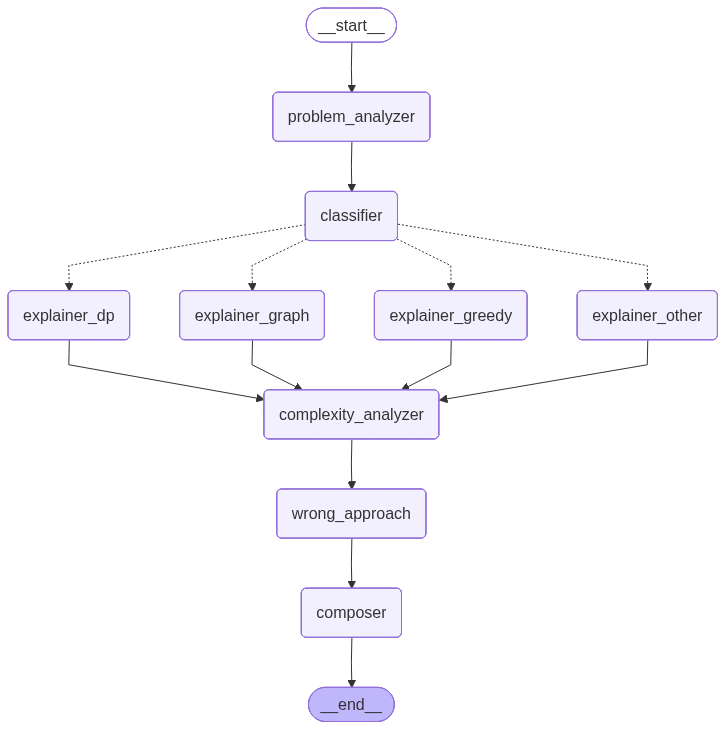

# Post-Contest Editorial Generator

An intelligent system that automatically generates comprehensive editorials for competitive programming problems using LangGraph workflow and a set of specialized agents.

## Features

- Intelligent problem analysis that extracts the important pieces of the statement
- Algorithm classification (greedy, dynamic programming, graph, other)
- Branching workflow: routes to specialized explainers per algorithm type
- Detailed explanations with intuition and step-by-step breakdowns
- Complexity analysis (time & space) with justification
- Common pitfalls and wrong approaches
- Composes a polished Markdown editorial

## Architecture

The workflow is implemented as a small graph of Python modules under the repository root. The high-level flow is:

- `main.py` prepares an initial state (problem statement + accepted solution)
- `agents/` contains individual agent modules that process parts of the state
- `graphs/editorial_graph.py` wires the agents into a conditional workflow
- The final editorial is composed and written to `output/editorial.md`

Here is the workflow diagram used by the project:



### High level flow

- problem_analyzer -> classifier -> (explainer_dp | explainer_graph | explainer_greedy | explainer_other) -> complexity_analyzer -> wrong_approach -> composer

## Project structure

Top-level layout (key files/folders):

- `main.py` — demo runner and entrypoint for the graph
- `agents/` — per-task agent modules
  - `problem_analyzer.py`
  - `classifier.py`
  - `explainer_greedy.py`
  - `explainer_dp.py`
  - `explainer_graph.py`
  - `explainer_other.py`
  - `complexity_analyzer.py`
  - `wrong_approach.py`
  - `composer.py`
- `graphs/editorial_graph.py` — defines and wires the workflow
- `prompts/` — prompt templates used by agents (text snippets)
- `utils/` — helpers and constants
- `input/` — example problem/solution used by the demo
- `output/editorial.md` — generated editorial (demo output)
- `editorial_workflow.png` — diagram of the workflow

## Requirements & setup

- Python 3.13

Install dependencies listed in `requirements.txt` into a virtual environment:

```powershell
python -m venv venv; .\venv\Scripts\Activate;
pip install -r requirements.txt
```

## Configuration

Create a `.env` or export environment variables if you want to configure model settings or API keys:

```text
# Example
GEMINI_API_KEY=your_api_key_here
GEMINI_MODEL=gemini-2.0-flash
GEMINI_TEMPERATURE=1
LOG_LEVEL=INFO
```

## Running the demo

The repository includes a simple demo that uses the bundled sample files in `input/` and runs:

```powershell
python main.py
```

What the demo does:
- Loads the sample problem and solution
- Constructs the editorial workflow from `graphs/editorial_graph.py`
- Runs the workflow (invokes agents in order)
- Writes `output/editorial.md` and prints a short status message

## Streamlit frontend

This repository now includes a small Streamlit UI for running the generator from a browser.

Run it locally:

```powershell
streamlit run streamlit_app.py
```

What the UI provides:
- Paste or upload a problem statement
- Paste or upload the accepted solution
- Adjust model and temperature
- Generate and preview the Markdown editorial
- Download the result as `editorial.md`

## Docker

Build and run the container:

```powershell
docker build -t editorial-generator .
docker run --rm -p 8501:8501 --env-file .env editorial-generator
```

Then open:

```text
http://localhost:8501
```
